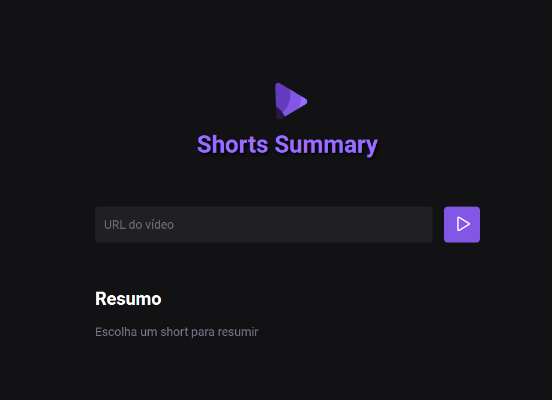

# NLW IA

> Trilha Foundations

Projeto web com inteligência artificial onde é feito um resumo em texto do áudio de um shorts do YouTube, criado na semana NLW IA da Rocketseat

## ⚙ Tecnologias

- HTML
- CSS
- Node.js
- APIs
- Git e Github

## 👨‍💻 Contato

sguedes.victor@gmail.com
